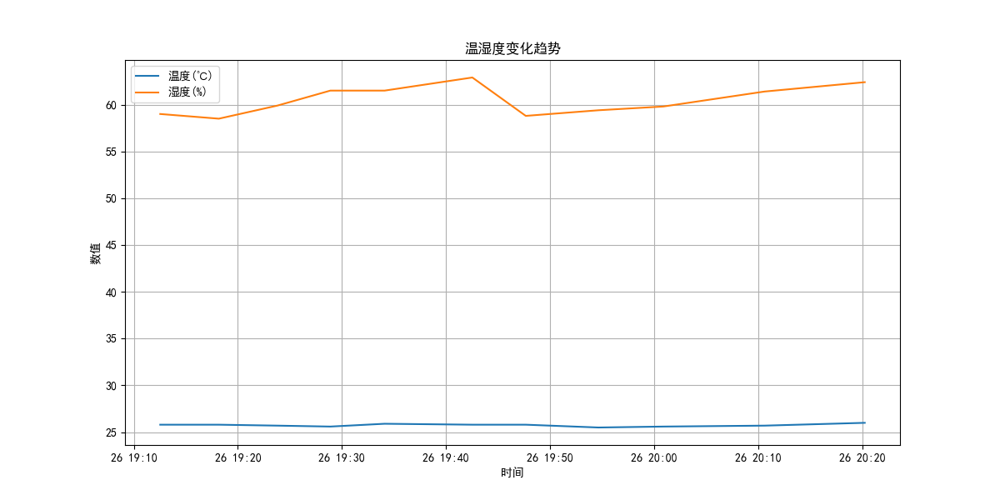

# XMWSDJ04MMC-Data-Logger
# 小米电子温湿度计数据监控工具



## 项目概述

Xiaomi TH Monitor 是一个用于监控小米电子温湿度计(XMWSDJ04MMC)数据的工具集，通过蓝牙低功耗(BLE)技术实时采集温湿度数据，存储为CSV格式，并提供数据可视化功能。

核心功能：
- 📡 蓝牙连接小米温湿度计并读取实时数据
- 💾 自动保存数据到CSV文件
- 📊 生成温湿度变化趋势图
- ⏱️ 支持定时自动数据采集
- 🔋 电池电量监控

## 支持设备

本项目专门针对 **小米电子温湿度计2 (XMWSDJ04MMC)** 开发

## 功能组件

| 文件 | 功能描述 |
|------|----------|
| `sensor_reader.py` | 蓝牙连接与数据读取核心模块 |
| `monitor.py` | 定时数据采集脚本 | 已弃用，功能合并到sensor_reader.py
| `viewer.py` | 数据可视化工具 | 可编辑
| `sensor_data.csv` | 数据存储文件 |

## 安装与配置

### 前提条件
- Python 3.7+
- Windows 10/11 或 Linux 系统
- 蓝牙4.0+适配器
- 小米温湿度计(XMWSDJ04MMC)

### 安装步骤

1. 克隆仓库：
   ```bash
   git clone https://github.com/Athment/XMWSDJ04MMC-Data-Logger.git
   cd XMWSDJ04MMC-Data-Logger
   ```

2. 安装依赖：
   ```bash
   pip install -r requirements.txt
   ```

3. Windows 蓝牙设置（仅Windows需要）：
   - 确保蓝牙功能已开启
   - 安装最新蓝牙驱动程序
   - 以管理员身份运行PowerShell执行：
     ```powershell
     Set-ExecutionPolicy Unrestricted -Scope CurrentUser
     ```

## 使用说明

### 1. 单次数据采集
```bash
python sensor_reader.py
```

### 2. 定时监控（每5分钟采集一次）（已弃用）
```bash
python monitor.py
```

### 3. 定时监控（每5分钟采集一次）
```bash
python sensor_reader_new.py
```

生成的数据将保存为 `sensor_data.csv`
### 4. 数据可视化
```bash
python viewer.py
```

生成的图表将保存为 `sensor_data.png`

## 文件说明

### `sensor_reader.py`
蓝牙数据采集核心模块：
- 自动连接小米温湿度计
- 解析温湿度及电池数据
- 保存数据到CSV文件
- 提供Windows蓝牙设置指南

### `sensor_reader_new.py`
定时数据采集脚本：
- 可配置采集间隔（默认10分钟）
- 持续运行模式
- 集成数据采集日志

### `viewer.py`
数据可视化工具：
- 读取CSV数据文件
- 生成温湿度变化趋势图
- 支持中文标题和标签
- 自动保存为PNG图像

### `sensor_data.csv`
数据存储格式：
```csv
Timestamp,Temperature(℃),Humidity(%),Battery(%)
2025-06-26 19:12:32,25.8,59.0,113
2025-06-26 19:18:10,25.8,58.5,105
...
```

## 技术细节

### 数据解析
小米温湿度计使用自定义BLE特征值传输数据：
```python
def parse_sensor_data(data):
    # 前2字节：温度（有符号整数，单位0.1℃）
    # 后2字节：湿度（无符号整数，单位0.1%）
    # 第5字节：电池电量（可选）
    temp_raw = struct.unpack('<h', data[:2])[0]
    hum_raw = struct.unpack('<H', data[2:4])[0]
    temperature = temp_raw / 10.0
    humidity = hum_raw / 10.0
    battery = data[4] if len(data) >= 5 else None
    return temperature, humidity, battery
```

### 蓝牙参数
| 参数 | 值 |
|------|----|
| 服务UUID | `ebe0ccb0-7a0a-4b0c-8a1a-6ff2997da3a6` |
| 特征UUID | `ebe0ccc1-7a0a-4b0c-8a1a-6ff2997da3a6` |

## 注意事项

1. **设备连接**：
   - 确保温湿度计在蓝牙范围内（约10米）
   - 首次使用可能需要手动配对
   - 设备MAC地址可在代码中配置

2. **Windows蓝牙限制**：
   - 可能需要管理员权限
   - 避免多个程序同时访问蓝牙设备
   - 如果连接失败，重启蓝牙服务

3. **电池优化**：
   - 设备电池寿命约1年（CR2032）
   - 频繁读取会加速电量消耗
   - 建议监控间隔≥5分钟

## 解释说明
- 设备MAC地址需要你从米家或者其他渠道获取。
- 单次数据采集配套的monitor.py定时功能会断开温湿度计蓝牙，导致需要手动重启。
- sensor_reader_new.py在不断开温湿度计蓝牙的情况下，每5分钟获取并保存一次数据。关闭数据获取只需中断代码。

## 贡献指南

欢迎通过Issue或Pull Request贡献代码：
1. 提交新功能建议或问题报告
2. 创建分支开发新功能
3. 确保代码符合PEP8规范
4. 更新相关文档


---

**让环境监测更智能** - 使用小米温湿度计和Python打造专业的温湿度监控系统！
